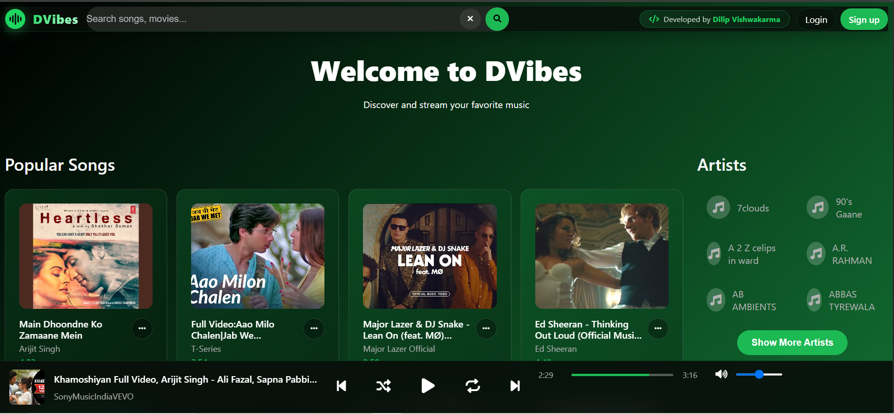

# 🎵 Dvibes

Dvibes is a modern music library and streaming web application that allows users to discover, explore, and enjoy their favorite music through a clean and interactive interface.

## ✨ Features

### 🎧 Music Streaming
- Play songs instantly
- Play / Pause controls
- Next & Previous track navigation
- Shuffle playback
- Loop/Repeat songs
- Queue management (Play Next)
- Ordered playlist playback
- seeking

### 👤 User Accounts
- Create and manage user accounts
- Secure login and signup system
- Guest mode for listening without registration

### 📚 Personalized Experience
Registered users get access to additional features such as:
- 📂 Create and manage playlists
- 🕒 Playback history
- 🎵 Resume from the last played song
- Personalized music experience

### 🔍 Music Discovery
- Browse songs by genre
- Search songs
- Explore artists
- Random song recommendations

### 🎨 User Interface
- Modern and responsive design
- Smooth music player
- Interactive user experience
- Mobile-friendly layout

---

## 🛠️ Technologies Used

- PHP
- MySQL
- JavaScript
- HTML5
- CSS3

---

## 🚀 Live Demo

🔗 **Try Dvibes Online:**  
https://dilipaudistream.page.gd/App
---

## 📂 Project Features

- User Authentication
- Guest Login
- Music Streaming
- Playlist Management
- Playback Queue
- Song Search
- Artist & Genre Browsing
- Playback History
- Like Songs
- Responsive UI

---

## 📸 Screenshots

---

## 📄 License

This project is intended for educational and personal learning purposes.